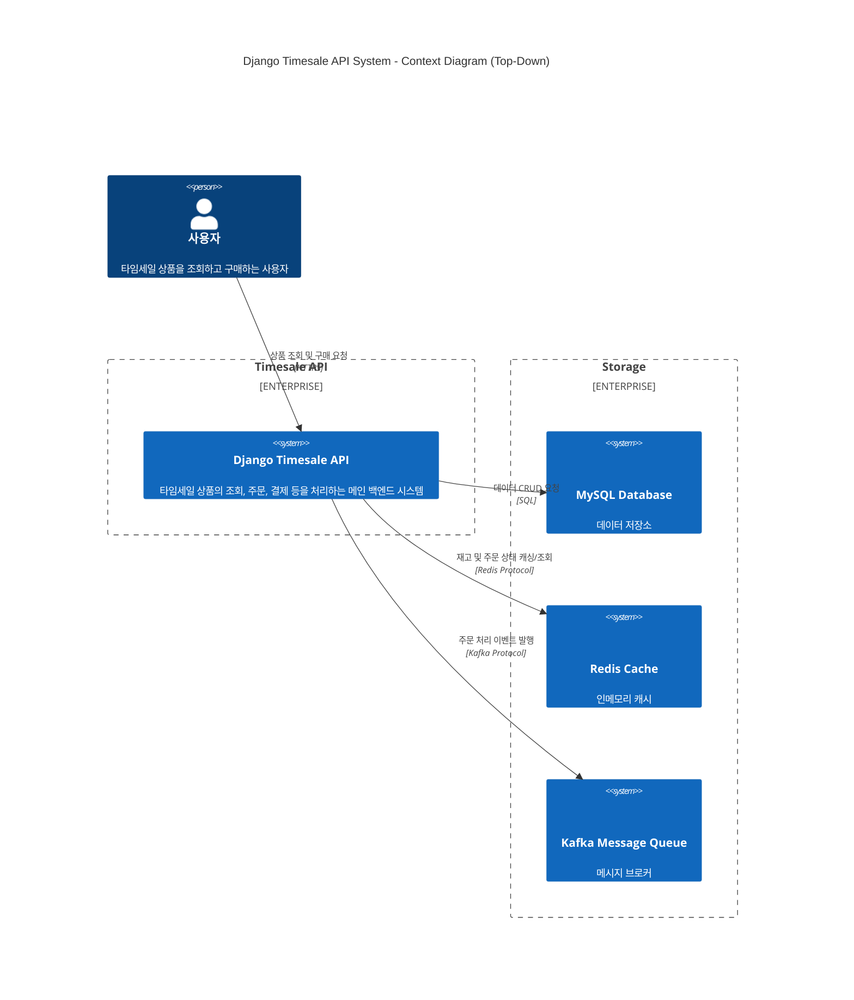
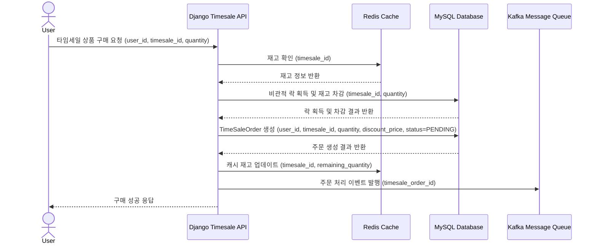

# 2. 전체 문서 (Overall Description)

## 목차

- [2. 전체 문서 (Overall Description)](#2-전체-문서-overall-description)
    - [목차](#목차)
    - [2.1 Product Perspective (제품 조망)](#21-product-perspective-제품-조망)
        - [2.1.1 주요 도메인 모델](#211-주요-도메인-모델)
            - [2.1.1.1 Product (상품)](#2111-product-상품)
            - [2.1.1.2 TimeSale (타임세일)](#2112-timesale-타임세일)
            - [2.1.1.3 TimeSaleOrder (타임세일 주문)](#2113-timesaleorder-타임세일-주문)
    - [2.2 Overall System Configuration (전체 시스템 구성)](#22-overall-system-configuration-전체-시스템-구성)
        - [2.2.1 System Context](#221-system-context)
    - [2.3 Overall Operation (전체 동작방식)](#23-overall-operation-전체-동작방식)
    - [2.4 Product Functions (제품 주요 기능)](#24-product-functions-제품-주요-기능)
    - [2.5 User Classes and Characteristics (사용자 계층과 특징)](#25-user-classes-and-characteristics-사용자-계층과-특징)
    - [2.6 Assumptions and Dependencies (가정과 종속 관계)](#26-assumptions-and-dependencies-가정과-종속-관계)
    - [2.7 Apportioning of Requirements (단계별 요구사항)](#27-apportioning-of-requirements-단계별-요구사항)
    - [2.8 Backward compatibility (하위 호환성)](#28-backward-compatibility-하위-호환성)

## 2.1 Product Perspective (제품 조망)

타임세일 API는 전자상거래 플랫폼의 핵심 마케팅 도구로서, 시간 제한이 있는 할인 상품 판매를 효율적으로 관리하기 위한 독립적인 백엔드 서비스입니다.
본 시스템은 Django REST Framework를 기반으로 구축되어, RESTful API 인터페이스를 통해 타임세일 관련 모든 비즈니스 로직을 처리합니다.

### 2.1.1 주요 도메인 모델

#### 2.1.1.1 Product (상품)

상품 정보를 나타내는 도메인 모델입니다. 상품 ID, 이름, 가격, 설명 등의 속성을 가집니다.

- 타임세일 대상이 되는 기본 상품 정보
- 상품명, 원가격, 상품 설명 등의 기본 속성 관리

| 속성            | 설명               |
|---------------|------------------|
| `product_id`  | 상품의 고유 식별자입니다.   |
| `name`        | 상품의 이름입니다.       |
| `price`       | 상품의 가격입니다.       |
| `description` | 상품에 대한 상세 설명입니다. |

#### 2.1.1.2 TimeSale (타임세일)

- 타임 세일 정보를 나타내는 도메인 모델입니다. 상품, 수량, 할인 가격, 시작/종료 시간, 상태 등의 속성을 가집니다.
    - 특정 상품에 대한 시간 한정 할인 이벤트
    - 할인 가격, 할인 수량, 세일 기간 등의 세일 관련 정보
    - ACTIVE/INACTIVE 상태를 통한 세일 활성화 제어

| 속성                   | 설명                                   |
|----------------------|--------------------------------------|
| `timesale_id`        | 타임 세일의 고유 식별자입니다.                    |
| `product`            | 타임 세일이 적용되는 상품입니다.                   |
| `quantity`           | 타임 세일로 판매되는 총 수량입니다.                 |
| `remaining_quantity` | 타임 세일로 판매 가능한 남은 수량입니다.              |
| `discount_price`     | 타임 세일이 적용된 할인 가격입니다.                 |
| `start_at`           | 타임 세일 시작 시간입니다.                      |
| `end_at`             | 타임 세일 종료 시간입니다.                      |
| `status`             | 타임 세일의 상태를 나타냅니다. (ACTIVE, INACTIVE) |

#### 2.1.1.3 TimeSaleOrder (타임세일 주문)

- 타임 세일 주문 정보를 나타내는 도메인 모델입니다.
    - 사용자 ID, 타임 세일, 수량, 할인 가격, 주문 상태 등의 속성을 가집니다.

| 속성                  | 설명                                             |
|---------------------|------------------------------------------------|
| `timesale_order_id` | 타임 세일 주문의 고유 식별자입니다.                           |
| `user_id`           | 주문한 사용자의 ID입니다.                                |
| `time_sale`         | 주문과 관련된 타임 세일입니다.                              |
| `quantity`          | 주문한 수량입니다.                                     |
| `discount_price`    | 주문에 적용된 할인 가격입니다.                              |
| `status`            | 주문의 현재 상태를 나타냅니다. (PENDING, COMPLETED, FAILED) |

## 2.2 Overall System Configuration (전체 시스템 구성)

### 2.2.1 System Context

## 2.3 Overall Operation (전체 동작방식)

## 2.4 Product Functions (제품 주요 기능)

| 분류          | 기능명 (API 함수명)                           | 주요 내용                                                                                                                  | 테스트 케이스 목록                                                                                                                                                                                                                                                                                                                                                  |
|-------------|-----------------------------------------|------------------------------------------------------------------------------------------------------------------------|-------------------------------------------------------------------------------------------------------------------------------------------------------------------------------------------------------------------------------------------------------------------------------------------------------------------------------------------------------------|
| **상품 관리**   | 상품 생성 (`create_product`)                | - 새로운 상품을 시스템에 등록 - 상품명, 가격, 상품 설명 정보 관리                                                                            | - `test_create_product_success`: 상품 생성 테스트 - 성공 - `test_create_product_missing_name`: 상품명 누락 시 예외 처리 테스트 - `test_create_product_missing_price`: 가격 누락 시 예외 처리 테스트 - `test_create_product_missing_description`: 상품설명 누락 시 예외 처리 테스트 - `test_create_product_empty_name`: 빈 상품명 전달 시 테스트 - `test_create_product_negative_price`: 음수 가격 전달 시 테스트 |
|             | 상품 조회 (`get_product`)                   | - 특정 상품의 상세 정보 조회                                                                                                      | - `test_get_product_existing_id`: 존재하는 상품 ID로 조회 성공 테스트 - `test_get_product_non_existing_id`: 존재하지 않는 상품 ID로 조회 시 예외 처리 테스트                                                                                                                                                                                                                              |
|             | 상품 목록 (`get_all_products`)              | - 전체 상품 목록 조회                                                                                                          | - `test_get_all_products_with_data`: 상품이 존재할 때 전체 목록 조회 테스트 - `test_get_all_products_empty`: 상품이 존재하지 않을 때 빈 목록 반환 테스트                                                                                                                                                                                                                                   |
| **타임세일 관리** | 타임세일 생성 (`create_timesale`)             | - 새로운 타임세일 이벤트 생성 - 상품 ID, 할인 수량, 할인 가격 설정 - 세일 시작/종료 시간 설정                                                      | - `test_create_timesale_success`: 타임세일 생성이 정상적으로 수행되는 경우 - `test_create_timesale_fail_due_to_invalid_time`: 시작 시간이 종료 시간보다 늦은 경우 예외가 발생하는지를 테스트합니다. - `test_create_timesale_with_not_exit_product`: 존재하지 않은 상품으로 타임세일 생성 시 예외가 발생하는지 테스트                                                                                                              |
|             | 타임세일 조회 (`get_timesale`)                | - 특정 타임세일 정보 조회                                                                                                        | - `test_get_timesale_success`: 유효한 타임세일 ID에 대해 상세 정보를 정상적으로 조회할 수 있는지 테스트합니다. - `test_get_timesale_not_found`: 존재하지 않는 타임세일 ID로 조회 시 예외가 발생하는지를 테스트합니다.                                                                                                                                                                                                  |
|             | 진행 중인 타임세일 목록 (`get_ongoing_timesales`) | - 현재 활성화된 타임세일 페이지네이션 조회 - 시작 시간 ≤ 현재 시간 ≤ 종료 시간 조건 필터링 - 상태가 ACTIVE인 타임세일만 조회 - 페이지 기반 목록 조회 지원              | - `test_get_ongoing_timesales_success`: 현재 진행 중인 타임세일이 정상적으로 필터링되고 페이지네이션되어 반환되는지를 테스트합니다. - `test_get_ongoing_timesales_empty`: 조건에 해당하는 타임세일이 없을 때 빈 리스트를 반환하는지를 테스트합니다.                                                                                                                                                                               |
| **구매 처리**   | 타임세일 구매 (`purchase_time_sale`)          | - 타임세일 상품 구매 처리 - 비관적 락(Pessimistic Lock)을 통한 동시성 제어 - 실시간 재고 차감 처리 - 주문 객체 생성 및 상태 관리 - 트랜잭션 기반 안전한 구매 처리 | - `test_purchase_timesale_success`: 타임세일 구매 요청이 정상적으로 처리되고 주문 및 재고 차감이 이루어지는지를 테스트합니다. - `test_purchase_timesale_out_of_stock`: 재고가 부족한 상황에서 예외가 발생하는지를 테스트합니다. - `test_purchase_timesale_not_in_progress`: 타임세일 기간이 아닌 경우 구매 실패하기                                                                                                                    |

## 2.5 User Classes and Characteristics (사용자 계층과 특징)

## 2.6 Assumptions and Dependencies (가정과 종속 관계)

## 2.7 Apportioning of Requirements (단계별 요구사항)

## 2.8 Backward compatibility (하위 호환성)
